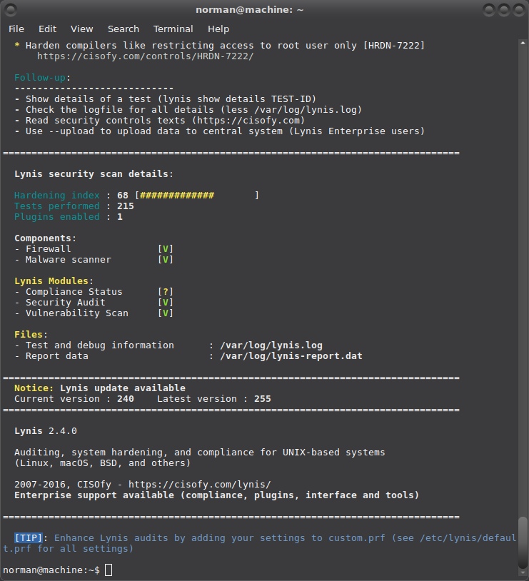

# Lynis

Lynis is an open source security tool. It helps with auditing systems running UNIX-alike systems (Linux, macOS, BSD), and providing guidance for system hardening and compliance testing.

It scans the system configuration and creates an overview of system information and security issues usable by professional auditors. It can assist in automated audits and can be used in addition to other software, like security scanners, system benchmarking and fine-tuning tools. 

## Installation 
    
    $ sudo apt-get lynis

## Configuration 

Lynis first run:

    $ sudo lynis audit system

