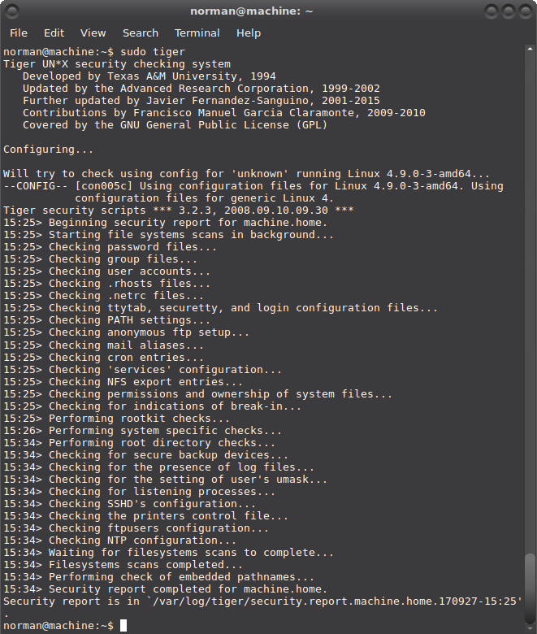

# Tiger

Tiger, or the `tiger scripts, is a set of Bourne shell scripts, C programs and data files which are used to perform a security audit of different operating systems. It's primary goal is to report ways the system's security can be compromised.

The tools can be both run altogether once to generate an audit report of the system and they can also be run periodically to provide information on changes to the system's security once a security baseline has been defined. Meaning, they can also be used also as a host intrusion detection mechanism. The tools rely on specialised external security tools such as John the Ripper, Chkroot and integrity check tools (like [Tripwire](../ids/Tripwire.md), Integrit or [Aide](../ids/Aide.md)) for some of the tasks. The periodic review mechanism relies on the use of the cron task scheduler and an email delivery system.

Debian's `tiger` incorporates new checks primarily oriented towards Debian distribution. The package provides all the security scripts and data files.

## Installation 

    $ sudo apt-get install tiger

## Configuration

Tiger first run:

    $ sudo tiger

* Mess with the tiger variables in the `/etc/tiger/tigerrc` configuration file. For each available module there is a corresponding variable in the file that determines whether the module is run. A variable can be set equal to Y to run, or N to skip. Other configuration variables will modify the behaviour of some modules, and can be adjusted based on the operating system.
* The `/etc/tiger/tiger.ignore` configuration file defines the set of messages that will not be presented in the report even if any of the modules generate them. All entries (per line) are used as extended regular expressions that are compared against each message (mind the overhead which grows with the size of the file).

## Examples 
The command `tig‐exp` can be used to obtain explanations of the problems reported by tiger.

### Checking passwd files 

    --WARN-- [pass014w] Login (name) is disabled, but has a valid shell.

The listed login ID is disabled in some manner (‘*’ in passwd field, etc), but the login shell for the login ID is a valid shell (from /etc/shells or the system equivalent). A valid shell can potentially enable the login ID to continue to be used. An attacker can hide programs within these shells by simply ‘su’ing into these accounts.

Debian comes with some predefined users listed in `/etc/passwd`:

* The default behaviour is that [UID’s from 0 to 99 are reserved in Debian](https://www.debian.org/doc/debian-policy/) to ease the installation of some services that require that they run under an appropriate user/UID. If you do not intend to install these services, you can safely remove those users who do not own any files in your system and do not run any services.
* UID’s from 100 to 999 are created by packages on install (and deleted when the package is purged). Some of the accounts in this range are users linked to programs you’re running. In general, it is better to prune your system via the associated packages than try to manage them manually.
* Manually created users end up with a UID just above 1000 (unless you manually specified the uid).

For example `www-data` in most cases, does not need a shell, but some cgi could need it. Historically all users under UID 99 had a `/bin/sh` as login shell, and the ones found and listed here by tiger are historic or legacy users, for all “modern” linux services already come preconfigured to `/bin/false`. For those not preconfigured, you can dig into your system to know what each user does there:

* Do a `top` or a `ps aux` and check the users; if there’s a process started by “nobody” user you can’t delete it.
* Also check crontab and cron.d; if you delete a user required for starting a cron job, that job will never work again.
* Another useful check is to check the `/etc/shadow` file and see which second fields are X (crossed out) for which accounts.

If you conclude a process shouldn’t be there, then stop the daemons, uninstall its packages, and then delete the users. If you are unsure about deleting a user used as administrative user you can set its shell to `/bin/false` or `/sbin/nologin` (or something else that doesn’t exist). The user will remain there but nobody will get a shell from it.

Always leave the shell for your user and root user. Whatever you do, do NOT remove or change the shell for root.

    --WARN--­­ [pass015w] Login ID sync does not have a valid shell (/bin/sync)

The listed login ID does not have a valid login program or shell. Usually these Shells are defined in `/etc/shells`.

This is a special case in which there is not a valid shell for sync. `/bin/sync` is a valid file with a valid purpose. You can ignore.

    --WARN­­-- [pass006w] Integrity of password files questionable (/usr/sbin/pwck ­r).

The password files have integrity issues as found by [pwck -r](https://www.sanfoundry.com/pwck-command-usage/). This can lead to looping of password manipulation programs and to authentication or login issues if not corrected. Install the relevant packages or create the directory and set permissions for only limited access.

    $ sudo /usr/sbin/pwck -r

### Checking user accounts

    --WARN­­-- [acc022w] Login ID nobody home directory (/nonexistent) is not accessible.

But without a valid home directory, the user could end up with `/` as the home directory. You can disable his shell in `/etc/passwd` by setting it to `/bin/false` or `/sbin/nologin` and ignore the resulting error, or you can create the directory, change its ownership and permissions.

    $ sudo mkdir /nonexistent
    $ chown nobody:nobody /nonexistent
    $ chmod 400 /nonexistent

### Checking cron entries 

Cron allows users to submit jobs for the system to do at a particular, possibly recurring time. It can be very useful, but also has a very real potential for abuse by either users or system crackers. Users can be restricted to use cron by creating a `/etc/cron.allow` (holding only system administrators) or a `/etc/cron.deny` file (listing which users are not allowed access).

    --WARN-- [cron004w] Root crontab does not exist

Not a problem. Ignore.

    --WARN-- [cron005w] Use of cron is not restricted

For standard Debian systems, all users may use this command. Use the fix on [[Linux/UNIX Restricting at/cron Usage To Authorized Users](https://www.cyberciti.biz/faq/howto-restrict-at-cron-command-to-authorized-users/) here or ignore.
Checking services

    --WARN--­­ [inet003w] The port for service (x) is also assigned to service (y)

A program with a port assigned to TCP and a second entry for the same port with UDP. These service ports are defined in /etc/services and double entries is quite normal (it is about synonyms). You can just ignore or review these and make sure they are all synonyms and you don’t have two very different programs accessing the same port. Check the `/etc/services` file against the file the official assigning authority provides. Review open ports and if any, either uninstall or disable services you don’t use or want. Be careful.

### Checking system file permissions

    --ALERT-- [perm023a] /bin/su is setuid to 'root'

The explanation of tiger reads: The indicated file has the setuid bit set, but it should not have it. This should be changed by using chmod u-s file where ‘file’ is the indicated file. The system should be checked for signs of intrusion.

[Restricting the su command to superuser only](https://www.debianadmin.com/howto-restrict-su-command-to-superuser-only-in-linux.html) can affect some apps and packages that link to suid rooted su binary. For example, on debian it leads to an authentication failure when ‘su’ing in console or terminal of a user. My recommendation is to ignore this and those like it. You also don’t, for example, want to remove the suid bit from `/usr/bin/passwd`, for if you do no user will be able to change password.

Everything from `/bin/`, `/sbin/`, `/usr/bin` and `/usr/sbin` should be safe, they are part of the base OS. The most common reason for any program to be setuid is to enable it to act as root (setuid root) for access to hardware, secure storage, devices …

AND any vulnerability in a program that is set up as setuid root can get an attacker root-level access to your box, by running the command as a regular user (privilege escalation). If you can avoid it (or doing so is inconvenient or opens up other holes or cans of worms and authentication failures), you don’t want things to run setuid root.

If you are mounting shares that have setuid root files on them that were created by a user on another box, they can be used to own your box. There are options to mount such shares no-setuid – so the setuid bit on files will be ignored on that filesystem.

In particular, you don’t want files that are setuid to be writeable by non-root users, otherwise someone could replace them with malicious code that will then be executed as root.

If you find setuid binaries in non-binary filesystem locations (especially in for example `/tmp` or anywhere under `/var`) whose origins are unknown you may have been hacked. A setuid enabled binary for root under `/home/username/crack` smells definitely fishy.

Find all files (in `/usr/local/bin`) with `S_ISUID` bit set with:

    $ sudo find /usr/local/bin -perm +4000

And all files with `S_ISUID` and that are writeable by owner with:

    $ sudo find /usr/local/bin -perm -4200

### Checking network configuration

    --WARN-- [lin017w] The system is not configured to log suspicious (martian) packets

Fix with:

    $ sudo sysctl ­w net.ipv4.conf.all.log_martians=1

    $ sudo sysctl ­w net.ipv4.conf.default.log_martians=1

Yes, yes, I had forgotten those default versions. Also corrected in [Modifying kernel parameters]. 

