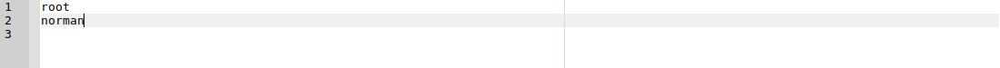

# Restricting access to cron

Cron allows users to submit jobs for the system to do at a later time, possibly a recurring time. It can be very useful, 
but also has a potential for abuse by either users or system crackers. Users can be blocked from administrative access 
to the crontab command for scheduling and modifying cron jobs.

The two configuration files that control user access to the cron daemon are `cron.allow` and `cron.deny` these two 
configuration files are located within the `/etc` directory and are similar to the `at.deny` and `at.allow` 
configuration files.

The `cron.allow` file is used to allows users to schedule jobs using the `cron` daemon, if the username does not exist in the `cron.allow` configuration file the user will be denied access. The `cron.deny` configuration file houses the username of users that are not allowed to schedule jobs, both configuration files have the same syntax as the `at.deny` and `at.allow` configuration files. Each username should be specified on an individual line.

