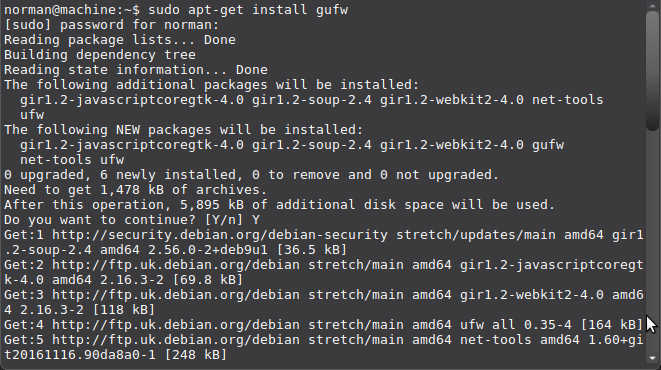
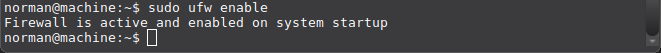

# Gufw and ufw

## Installation

Linux distributions come with a firewall installed (IPtables are built into the Linux kernel), but it is disabled because it would block some basic functionality for users on the local network. Specifically, it would block Samba and Avahi (zeroconf); limiting interoperability with other computers (like file and printer sharing) and disabling automatic discovery of network services. . It is better to turn it on. Especially on mobile devices like laptops, which sometimes connect to other networks than your own. it'll be in your menu items (the icon in mint is a brick wall).

You can install `ufw` (command-line) or `gufw`, a GUI frontend to `ufw`, and that will also install `ufw`:

## Enabling

The firewall is called `ufw` (**u**ncomplicated **f**ire**w**all), and can be operated from the terminal (//Menu > Accessories > Terminal//):

    $ sudo ufw enable

Type your password when prompted for it; this will remain entirely invisible, not even asterisks will be shown.

Ufw has a sensible set of default settings (profile), which are fine for the vast majority of home users. So unless you have special wishes: you're done!

## Checking status

You can check the status of the firewall with this command:

    $ sudo ufw status verbose
    Status: active
    Logging: on (low)
    Default: deny (incoming), allow (outgoing), disabled (routed)
    New profiles: skip

## Usage examples

### ICMP

By default, UFW allows ping requests. You may find you wish to leave (icmp) ping requests enabled to diagnose networking problems. To disable ping (ICMP) requests, edit `/etc/ufw/before.rules` and remove the following lines:

    # ok icmp codes
    -A ufw-before-input -p icmp --icmp-type destination-unreachable -j ACCEPT
    -A ufw-before-input -p icmp --icmp-type source-quench -j ACCEPT
    -A ufw-before-input -p icmp --icmp-type time-exceeded -j ACCEPT
    -A ufw-before-input -p icmp --icmp-type parameter-problem -j ACCEPT
    -A ufw-before-input -p icmp --icmp-type echo-request -j ACCEPT

or change the "ACCEPT" to "DROP":

    # ok icmp codes
    -A ufw-before-input -p icmp --icmp-type destination-unreachable -j DROP
    -A ufw-before-input -p icmp --icmp-type source-quench -j DROP
    -A ufw-before-input -p icmp --icmp-type time-exceeded -j DROP
    -A ufw-before-input -p icmp --icmp-type parameter-problem -j DROP
    -A ufw-before-input -p icmp --icmp-type echo-request -j DROP

### SSH 

    $ sudo ufw allow ssh
    $ sudo ufw enable
    $ sudo ufw status

