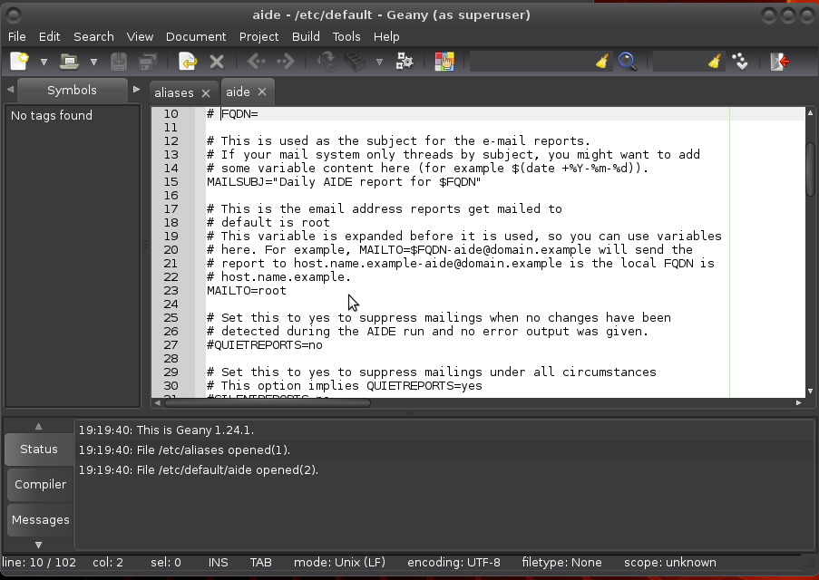
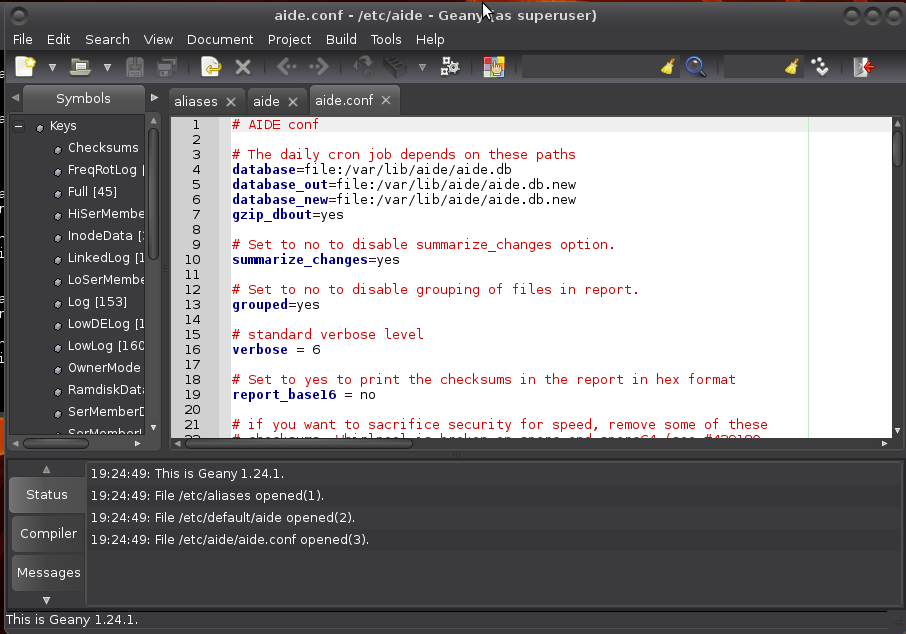

# Aide

The [Advanced Intrusion Detection Environment (Aide)](https://aide.github.io/), is a file integrity checker (FIA). It creates a database from the regular expression rules that it finds from the config file(s). Once this database is initialized it can be used to verify the integrity of the files. It has several message digest algorithms (md5, sha1, rmd160, tiger, crc32, sha256, sha512, whirlpool (additionally with libmhash: gost, haval, crc32b)) that are used to check the integrity of the file. All usual file attributes (//File type, Permissions, Inode, Uid, Gid, Link name, Size, Block count, Number of links, Mtime, Ctime// and //Atime//) can also be checked for inconsistencies. It can read databases from older or newer versions.

## Installation

To install aide on a debian based system:
    
    $ sudo apt-get install aide

Open up `/etc/default/aide` with your favourite editor to change who to send its reports to:

    $ sudo geany /etc/default/aide

## Initialisation

Initialisation (this can take some time) on debian based:

    $ sudo aideinit
    Running aide --init...
    Start timestamp: 2018-03-02 20:54:13 +0000 (AIDE 0.16)
    AIDE initialized database at /var/lib/aide/aide.db.new
    Verbose level: 6

    Number of entries:	163501

    ---------------------------------------------------
    The attributes of the (uncompressed) database(s):
    ---------------------------------------------------

    /var/lib/aide/aide.db.new
      RMD160   : ST44/Xwdiok4RmbkV61xDP9gXdg=
      TIGER    : TWH3gMXUUFA+MRy8iIdJPkPKxY39drxK
      SHA256   : K+TPo8r3/GANOt4L24mUnlAmM3BN4Ap7
                 7/xuFmq8xnU=
      SHA512   : xhZ9lhG50Xb8rmFF8AqFkd9TFqMDaE/T
                 FxEAebvt5eNmd/ayYab1fFEyefdZnu8G
                 HNkEo6H9f1Hn80+IN7sJdA==
      CRC32    : BdfVRg==
      HAVAL    : hVkhsvx02hXF5YmIyuiJMlNtAweYuOTP
                 Y2L043XMHW4=
      GOST     : T690cFLlnZhUQsCL4GaSjrJ0yHslK0Au
                 VRgW3dMWV4U=

    End timestamp: 2018-03-02 21:06:39 +0000 (run time: 12m 26s)

On other distros:

    sudo aide --init

## Configuration

Most aide configuration can be found in `/etc/aide/aide.conf`. This file is pretty well documented and default rules are quite decent. Aide aims at reporting files that changed since the last snapshot (stored in `/var/lib/aide/aide.db`). In hostile environments, a good security measure is to keep the database file on an external disk. If you have such a device, you can copy the current snapshot to it and use the snapshot from that device during later runs of aide.

Before making modifications to the configuration file, make a backup first:

    $ sudo cp /etc/aide/aide.conf /etc/aide/aide.conf.old

So let say that you have a copy of `aide.db` on an external disk. To use that snapshot, you can change //database=file:/var/lib/aide/aide.db// to //database=file:/media/user/drive/aide/aide.db//:

    $ sudo geany /etc/aide/aide.conf

Read through the file to acquaint yourself with aide. By default, changes in //Binaries// and //Libraries// directories are checked. Those are matched to the //BinLib// rule, which basically checks for any changes in permissions, ownership, modification, access and creation date, size change, md5 and sha1 signature, inode, number of links and block count. Then, it also checks for modifications in the //log files// against the rule //Logs//. Because log files tend to grow, you cannot use a signature there, and you also have to ask aide not to check for size modification (S).

## Usage

On debian and friends, aide is run on a daily basis through the script `/etc/cron.daily/aide`. Default settings in `/etc/default/aide` tells aide to update its database. Using `database_out` value in `/etc/aide/aide.conf`, aide is going to output a new database any time it runs in `/var/lib/aide/aide.db.new` (if you kept the default settings).

Any time you install new packages or change some configuration settings, run:

    $ sudo /etc/cron.daily/aide

And check in the report that any modifications were only done to files you intended to modify and that added files are only coming from packages you have just installed and copy the new database to whatever place your database points to. Great way to learn about linux and non-intended changes too. 

