# Tripwire

[Tripwire](https://www.tripwire.com) is a free software security and data integrity tool useful for monitoring and alerting on specific file change(s) on a range of systems. It functions as a host-based intrusion detection system. It is suitable for monitoring a small number of servers where centralized control and reporting is not needed and professional support is not a requirement.

Tripwire was originally a free, open source product and is now a commercial product but a free version (branched in 2000) is still being developed.

## Problems
* Needs `gcc` for compiling. Will not compile with newer gcc's.
* Tripwire provides no details about modified/added/removed files, only path names, unless one uses `twprint --report-level 4`, which is pretty verbose.
* Omits checksum if file size is zero, which is incorrect for Linux `/proc` files.
* Setting it up is hilariously hellish, hence I am spelling it out here.

## Installation

To install tripwire on a debian-based system:

    $ sudo apt-get install tripwire
    [sudo] password for user: 
    Reading package lists... Done
    Building dependency tree       
    Reading state information... Done
    The following NEW packages will be installed:
      tripwire
    0 upgraded, 1 newly installed, 0 to remove and 0 not upgraded.
    Need to get 1,385 kB of archives.
    After this operation, 10.4 MB of additional disk space will be used.
    Get:1 http://ftp.is.debian.org/debian/ jessie/main tripwire amd64 2.4.2.2-4 [1,385 kB]
    Fetched 1,385 kB in 0s (1,669 kB/s)
    Preconfiguring packages ...
    Selecting previously unselected package tripwire.
    (Reading database ... 142010 files and directories currently installed.)
    Preparing to unpack .../tripwire_2.4.2.2-4_amd64.deb ...
    Unpacking tripwire (2.4.2.2-4) ...
    Processing triggers for man-db (2.7.0.2-5) ...
    Setting up tripwire (2.4.2.2-4) ...

https://github.com/tymyrddin/orchard/blob/main/mitigations/assets/images/chrootkit.png

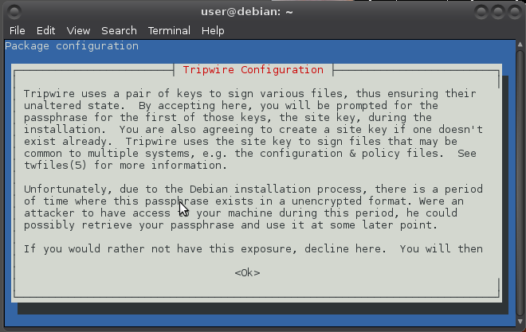

Use the arrow keys to navigate: 

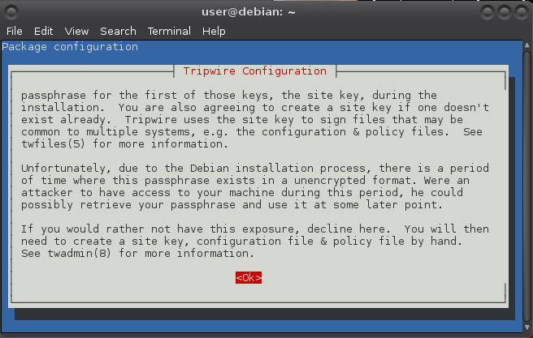

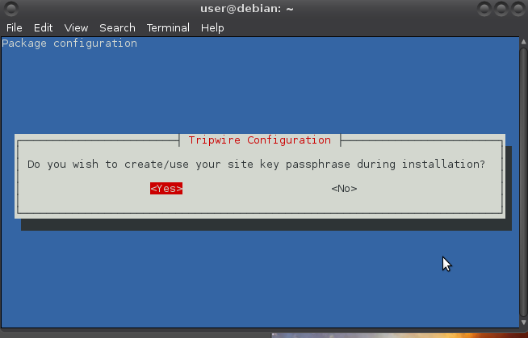

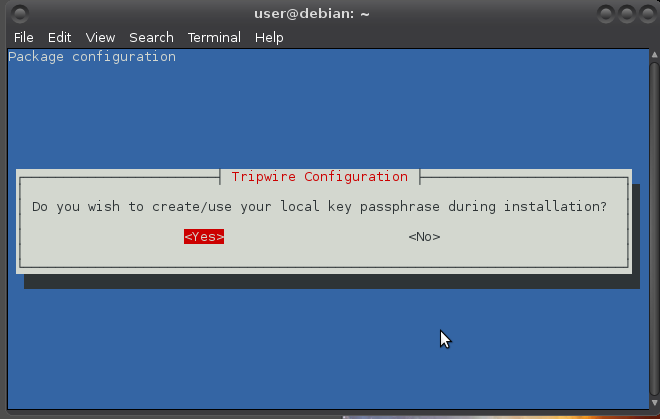

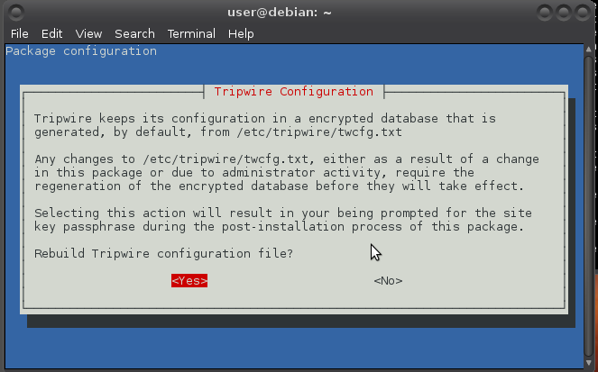

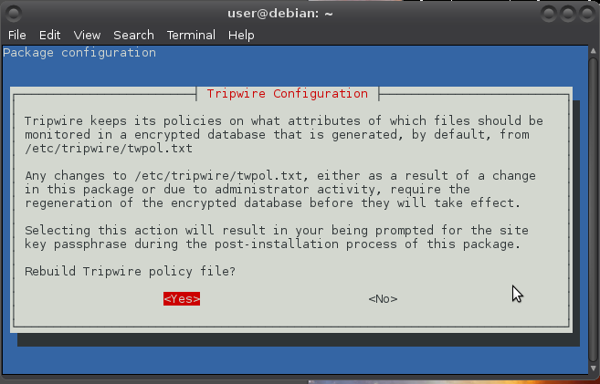

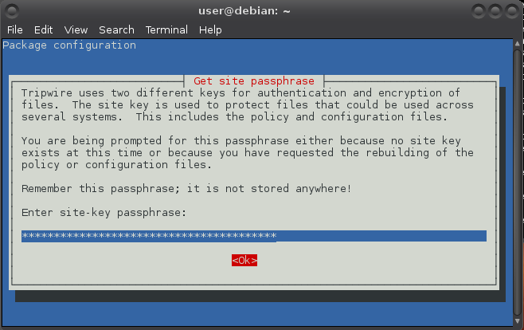

"Remember that passphrase", for example in keepassx (I also had keepassx generate the passphrase):

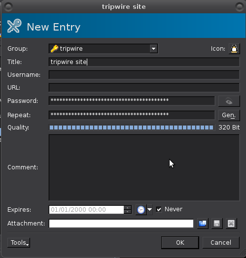 

Repeat: 

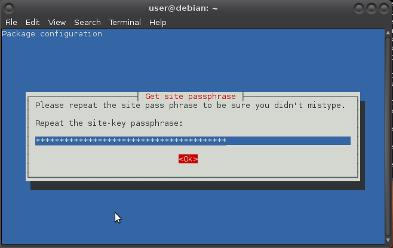 

    Generating site key (this may take several minutes)...

Do the same for local passphrase.

## Configuration

Just after install the tripwire directory /etc/tripwire contains a number of files, two of which are useful for its configuration.

* //twcfg.txt// is for general configuration and can easily be the same for all the computers on the same local network. It contains “things” like the location of the tripwire database, instructions for minimising the amount of time the passphrases are kept in memory, and the number of redundant reports.
* //twpol.txt// contains the policy that declares all the objects that must be monitored and what to do when one of them is lost or altered. Unlike the configuration file, the policy could (and almost certainly will) vary across the several computers on the same network.

For security reasons (preventing a malicious intruder from spoofing tripwire into giving a false “okay” message) tripwire uses these cleartext files to create binary files for database checking rather than the cleartext files (that are best immediately removed after the deed). If you make incorrect edits to either of these files, you will have to restore from backup or tripwire will not be able to create its database. Before making modifications to the configuration files, make a backup first: 

    $ cd /etc/tripwire
    $ sudo cp twcfg.txt twcfg.txt.old
    $ sudo cp twpol.txt twpol.txt.old

## Initialisation 

Install default policy as root (mind the capital P, and know the cursor does not move at all when copy/pasting the passphrase (right-click works on the command-line for copy/pasting)):

    # /usr/sbin/twadmin -m P /etc/tripwire/twpol.txt
    Please enter your site passphrase: 
    Wrote policy file: /etc/tripwire/tw.pol

Still as root, generate the initial database (You will be asked for your local passphrase):

    # /usr/sbin/tripwire -m i
    Please enter your local passphrase: 
    Parsing policy file: /etc/tripwire/tw.pol
    Generating the database...
    *** Processing Unix File System ***

It may take a while and then:

    ### Warning: File system error.
    ### Filename: /var/lib/tripwire/debian.twd
    ### No such file or directory
    ### Continuing...

Of course no such database exists (yet). This is the initial run to create it.

And a bunch of these appear with (hopefully) a success message at the end:

    ### Warning: File system error.
    ### Filename: /proc/5199/fd/4
    ### No such file or directory
    ...
    The object: "/proc/sys/fs/binfmt_misc" is on a different file system...ignoring.
    Wrote database file: /var/lib/tripwire/debian.twd
    The database was successfully generated.

The `twpol.txt` file distributed with tripwire contains anything that could be on a UNIX system, so it is guaranteed to complain about programs that you never installed or placed in a different location. These false positives are created when there is a discrepancy between the default policy and the actual local configuration. ACTUALLY!!!!! :D

Some further customization is necessary to prevent these large numbers of false positives. The “thing” to do to create a good policy is to remove as many unneeded programs as possible before starting. Next, to make your usage as quick and effective as possible, your policy must cover everything you really need to monitor and nothing else. This includes, at least, all the system binary and library directories (minimally the contents of `/bin`, `/sbin`, `/usr/bin`, `/lib`) and the corresponding configuration files in `/etc`.

As of version 2.3.1.2-5, the tripwire package manages policy at a directory level: if a directory appears in the policy, tripwire will add the files in that directory. Not all directory policy entries are recursive and tripwire may not check the contents of those subdirectories.

To generate a listing of the discrepancies between the local system and the default policy (or just do the first bit without grep and search for occurrences of "Filename"):

    # /usr/sbin/tripwire -m c | grep Filename >> twtest.txt

Waaaait for it! When this listing has been generated, edit `/etc/tripwire/twpol.txt` again, and comment out or delete each of the filenames listed in `twtest.txt`. Use your preferred editor (mine is geany):

    # geany /etc/tripwire/twpol.txt

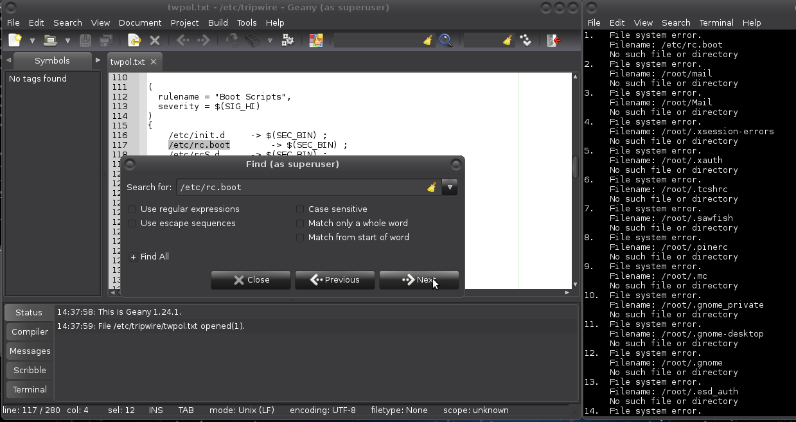

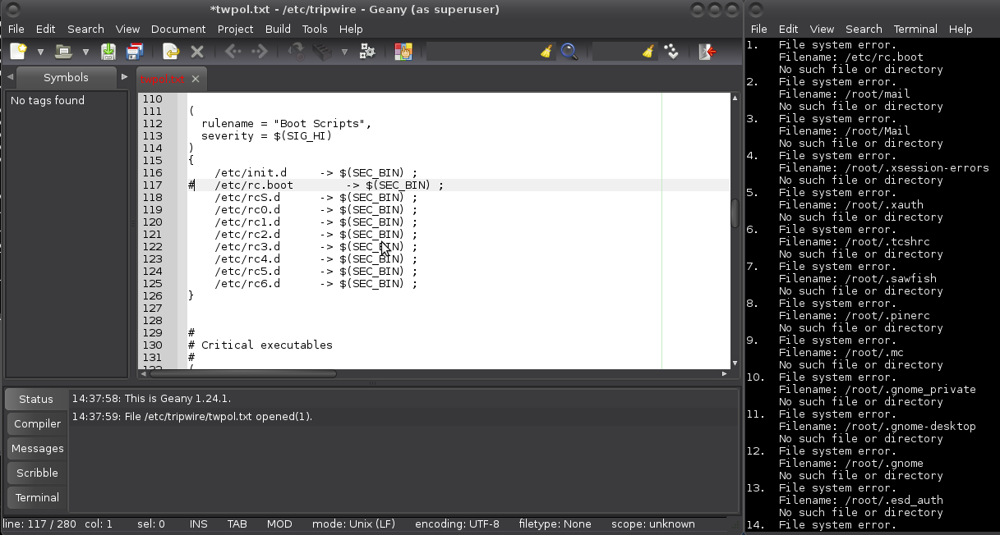

And there are other files in the default policy that may not make sense to monitor on your local system. These include lock files (which identify that some process is in use) and //pid// files (which identify the //process ID// of some //daemons//). Such files are likely to change often, if not at every system boot, and they can cause tripwire to generate false positives. You can comment out all of the `/var/lock/subsys` entries as well as the entry for `/var/run`.

After that you need to re-install default policy and generate the database again. This can result in:

    *** Processing Unix File System ***
    The object: "/dev/hugepages" is on a different file system...ignoring.
    The object: "/dev/mqueue" is on a different file system...ignoring.
    The object: "/dev/pts" is on a different file system...ignoring.
    The object: "/dev/shm" is on a different file system...ignoring.
    ### Warning: File system error.
    ### Filename: /proc/22273/fd/4
    ### No such file or directory
    ### Continuing...
    ### Warning: File system error.
    ### Filename: /proc/22273/fdinfo/4
    ### No such file or directory
    ### Continuing...
    ### Warning: File system error.
    ### Filename: /proc/22273/task/22273/fd/4
    ### No such file or directory
    ### Continuing...
    ### Warning: File system error.
    ### Filename: /proc/22273/task/22273/fdinfo/4
    ### No such file or directory
    ### Continuing...
    The object: "/proc/sys/fs/binfmt_misc" is on a different file system...ignoring.

Any `/dev` entries spell that the /dev file system also has other file systems mounted as `/dev/hugepages`, `/dev/mqueue`, `/dev/pts`, and `/dev/shm`. Similar objects in `proc` are also ignored. Directories in `/proc` change all the time and it is a pseudo-filesystem. My solution is to comment out both `/dev` and `/proc` and add the listed objects that have appeared and that appear.

    The object: "/proc/sys/fs/binfmt_misc/register" is on a different file system...ignoring.
    The object: "/proc/sys/fs/binfmt_misc/status" is on a different file system...ignoring.

`binfmt_misc` is a capability of the Linux kernel which allows arbitrary executable file formats to be recognised and passed to certain user space applications, such as emulators and virtual machines. The executable formats are registered through a special purpose file system interface (similar to `/proc`). Debian-based distributions provide the functionality through an extra //binfmt-support// package. Needs monitoring. So, added those two as well. 

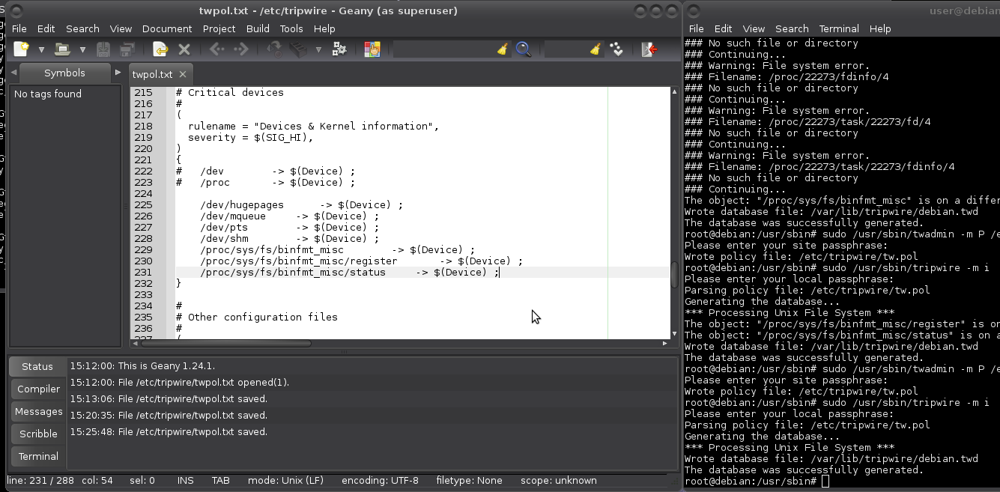

After that you need to re-install default policy and generate the database again.

## Cleaning up

It is now safe to delete the clear text versions of the tripwire policy and configuration files:

    # rm /etc/tripwire/twcfg.txt /etc/tripwire/twpol.txt

If they need to be restored, cleartext versions of these files can be created from the by tripwire encrypted versions (lowercase p):

    # usr/sbin/twadmin -m p > /etc/tripwire/twpol.txt

## Usage

    $ sudo /usr/sbin/tripwire -m c

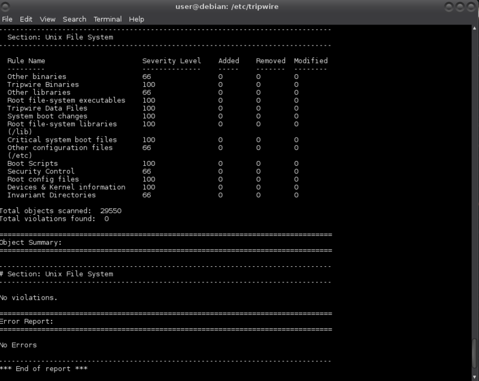

The management at a directory level also means that addition of packages to a system will almost certainly require the updating or regeneration of the tripwire database. 

