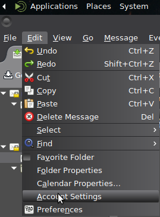
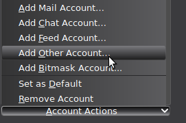
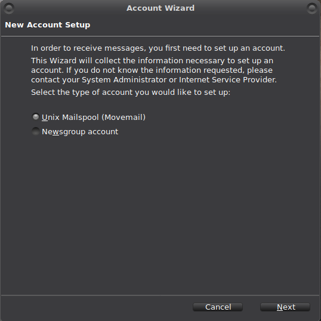
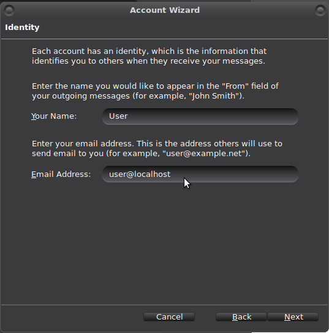
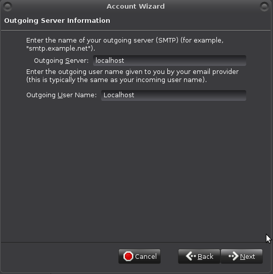
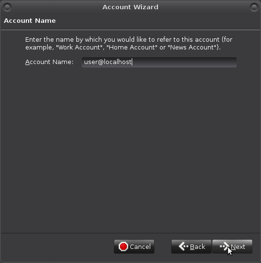
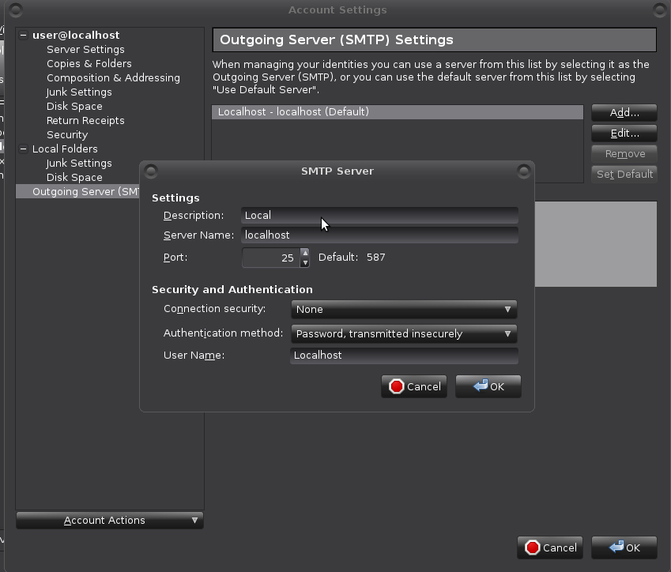
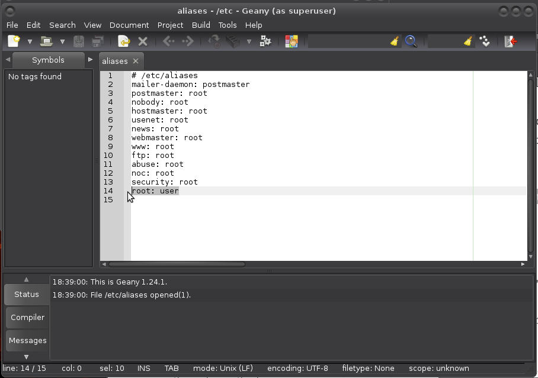

# Configuration of local mail in Thunderbird

Note: For this to work, your machine needs to be able to send email (needs a Message Transfer Agent).

Go to //Account Settings// in the top menu:

Then at bottom of navigation to //Account Actions// and choose //Add Other Account//:

Then //Movemail// and move through the wizard:

Use \yourusername@localhost\ as address:

In a thunderbird that already has an SMTP account configured, //Outgoing Server Information// will be filled in with no options for changing it. In a new thunderbird instance fill the information in like so (in either case these settings will be revisited, see below): 

Your "Account Name": 

If all went well the account has appeared. 

Create a local "outgoing" server in SMTP settings or revisit SMTP settings //Edit > Account Settings -> Outgoing Server (SMTP) -> Edit// (if the movemail wizard just created the "outgoing" server). Either way, this is what the settings looks like: 

You may already have messages for user. Maybe not for root yet.

Open `/etc/aliases` with your favourite editor (vi, vim, nano, geany):

    $ sudo geany /etc/aliases

And make sure there is a `root: username`, username being *your* username of course, and a `postmaster: root` line in the file:

