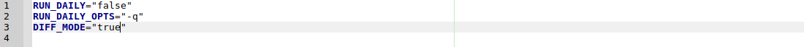
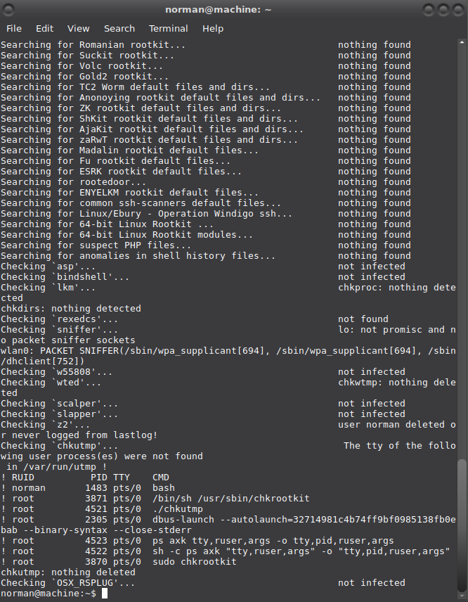

# chrootkit

chkrootkit (Free software) is a tool to locally check for signs of a rootkit.

## Installation

To install chkrootkit:

    $ sudo apt-get install chkrootkit

## Configuration

If you want an automatic daily run of `chkrootkit`, open `/etc/chkrootkit.conf` and replace `RUN_DAILY="false"` with `RUN_DAILY="true"`

    $ sudo geany /etc/chkrootkit.conf

## Usage

Using chkrootkit (perform all tests):

    $ sudo chkrootkit

And you may get something like: 

The man utmp reads: 

    The utmp file allows one to discover information about who is currently using the system. There may be more users currently using the system, because not all programs use utmp logging.

    Warning: utmp must not be writable, because many system programs (foolishly) depend on its integrity. You risk faked system logfiles and modifications of system files if you leave utmp writable to any user.

These messages are always worth checking out because chkrootkit compares all the user processes running in the system with what is registered in `/var/run/utmp`, reporting the fact that this particular process run by root is not registered (is hidden). It doesn't mean your system has cooties (rootkits or loggers), but it might.

In this case it is not the cooties, but xorg listening for remote desktop connection requests. :D I have tried turning it off. Not a good idea.

You may also get:

    Searching for suspicious files and dirs, it may take a while... The following suspicious files and directories were found: /usr/lib/jvm/.java-1.8.0-openjdk-amd64.jinfo

This is a false positive.

