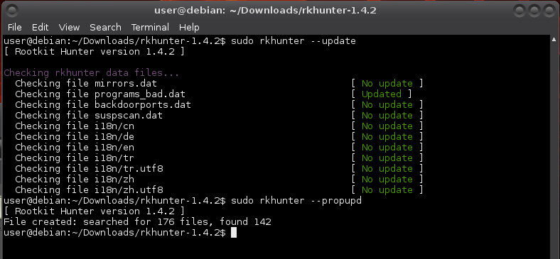
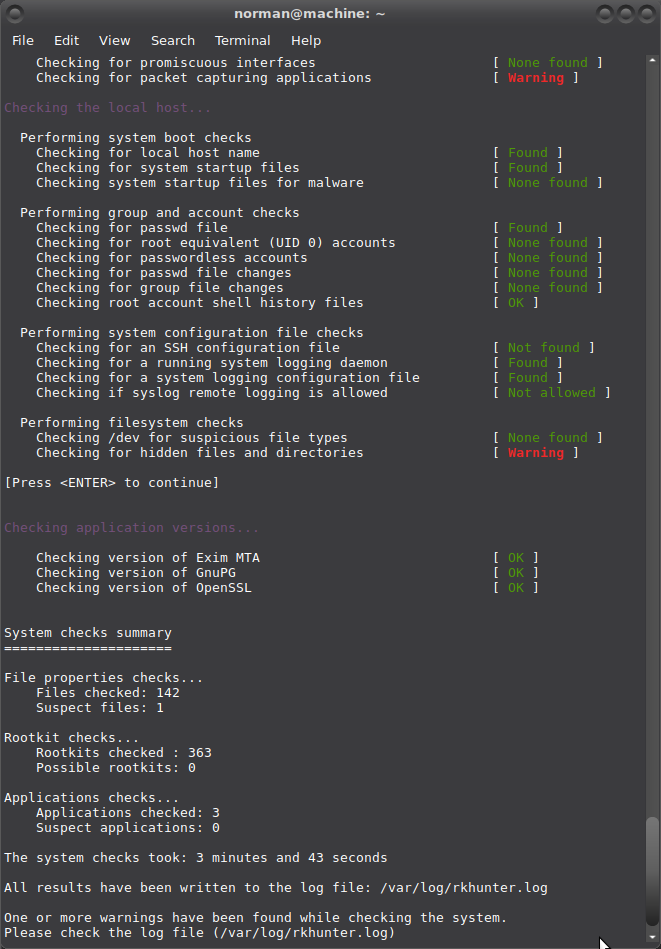
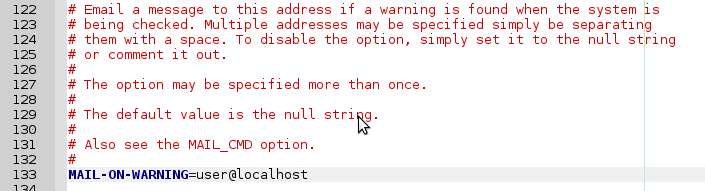
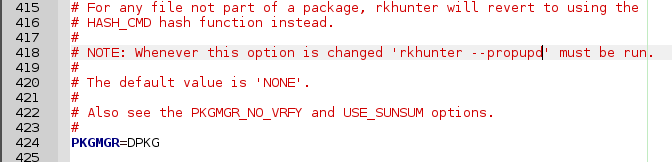
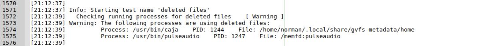
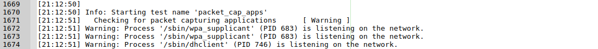
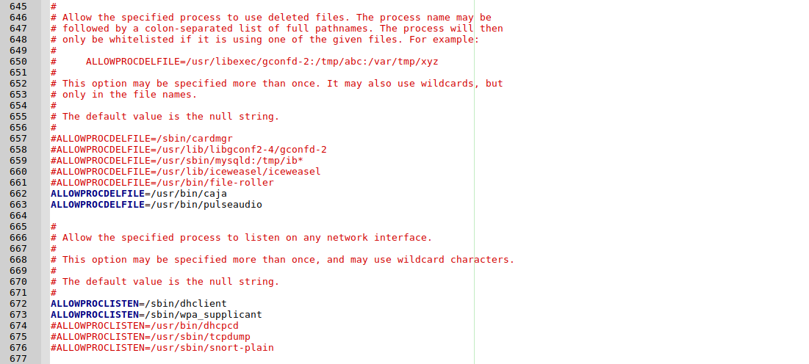
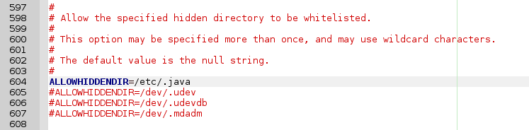
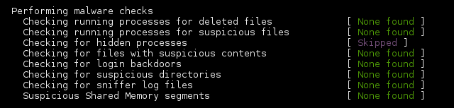

# rkhunter
Rootkit Hunter (GNU GPL) is a Unix-based tool that scans for rootkits, backdoors and possible local exploits. Specifically, rkhunter is a shell script which carries out various checks on the local system to try and detect known rootkits and malware. It also performs checks to see if commands have been modified, if the system startup files have been modified, and various checks on the network interfaces, including checks for listening applications. rkhunter has been written to be as generic as possible, and so should run on most Linux and UNIX systems. It is provided with some support scripts should certain commands be missing from the system, and some of these are Perl scripts. 

## Installation

### Repository
You can install it from repository:
    
    $ sudo apt-get install rkhunter

`unhide` is automatically installed too.

### Sourceforge
Or you can get get it from [sourceforge](http://sourceforge.net/projects/rkhunter/sourceforge) or check current version number and use `wget`:

    $ wget http://downloads.sourceforge.net/project/rkhunter/rkhunter/1.4.6/rkhunter-1.4.6.tar.gz

After download, extract the files and enter the resulting directory:

    $ tar xzvf rkhunter*
    $ cd rkhunter*

Run the install script:

    $ sudo ./installer.sh --layout /usr --install


## Configuration

### Update database

Update the rkhunter database:

    $ sudo rkhunter --update

Is temporarily not possible with versions older than 1.4.4, see [CVE-2017-7480](https://security-tracker.debian.org/tracker/CVE-2017-7480)

Once resolved, this command has to be run on a regular basis to keep the database of known rootkits current. You can use cron to schedule running of this command at regular intervals. 



### Baseline

Set baseline file properties by checking the current values and storing them as known-good values:

    $ sudo rkhunter --propupd

`rkhunter` is configured to be generic and each distro can (and most do) diverge from expected defaults. These appear during an initial run as false positives:

    $ sudo rkhunter -c --enable all --disable none

You'll get groups of results, warnings, and at the end a summary of the results. 



You can have a look at more details of the warnings in `/var/log/rkhunter.log`.

    $ sudo geany /var/log/rkhunter.log

And immediately encounter these noticeable two (on lines 17 and 44): 


Open up rkhunter's configuration file and while going through the warnings in the log, make the necessary changes:

    $ sudo geany /etc/rkhunter.conf

Remove the `#` in front of MAIL-ON-WARNING and replace the fake email adresses with your local mail account (see above): 



Likewise set the package manager: 



I am also getting warnings from the `deleted_files` test: 



No problem. Caja and pulseaudio need to be able to use `tmp` files. You can make the strings to allow processes using deleted files for in `/etc/rkhunter.conf` (debian-based):

    $ sudo awk '/Process: / {print "ALLOWPROCDELFILE="$3}' /var/log/rkhunter.log | sort -u
    [sudo] password for user:
    ALLOWPROCDELFILE=/usr/bin/caja
    ALLOWPROCDELFILE=/usr/bin/pulseaudio

Select and copy/paste the strings to the `/etc/rkhunter.conf` file (right-click mouse will give you the option to copy from command-line).

And a warning from the `packet_cap_apps` test: 




Get the strings for allowing (current) packet capturing applications:

    $ sudo awk -F"'" '/is listening on the network/ {print "ALLOWPROCLISTEN="$2}' /var/log/rkhunter.log
    [sudo] password for user: 
    ALLOWPROCLISTEN=/sbin/wpa_supplicant
    ALLOWPROCLISTEN=/sbin/dhclient

and add as well: 



The presence of the hidden `/etc/.java` directory also gives me a warning. So often do `/dev/.udev`, `/dev/.static` and `/dev/.initramfs`. These are known hidden (sofar) non-malignent hidden directories and can simply be whitelisted (only need commenting out):



ALL GREEN. Purrrrfect baseline. For now. :) In the near future more applications may try to use deleted files, and after installation of applications more warnings may appear that I'll have to deal with to keep it green! 

### Unhide
ACTUALLY, nearly all green and two purple: 



* `unhide` (ps) is for detecting hidden processes and implements six techniques:
  * Compare `/proc` vs `/bin/ps` output
  * Compare info gathered from `/bin/ps` with info gathered by walking through the `procfs`.
  * Compare info gathered from `/bin/ps` with info gathered from syscalls (syscall scanning).
  * Full PIDs space occupation (PIDs bruteforcing)
  * Reverse search, verify that all thread seen by `ps` are also seen by the kernel (`/bin/ps` output vs `/proc`, `procfs` walking and syscall)
  * Quick compare `/proc`, `procfs` walking and `syscall` vs `/bin/ps` output.
* `unhide-tcp` is a forensic tool that identifies TCP/UDP ports that are listening but are not listed in /bin/netstat through brute forcing of all TCP/UDP ports available. It comes with unhide.

```
$ sudo apt-get install unhide

$ sudo rkhunter --propupd

$ sudo rkhunter -c --enable all --disable none
```

Now it's all green. :) 

